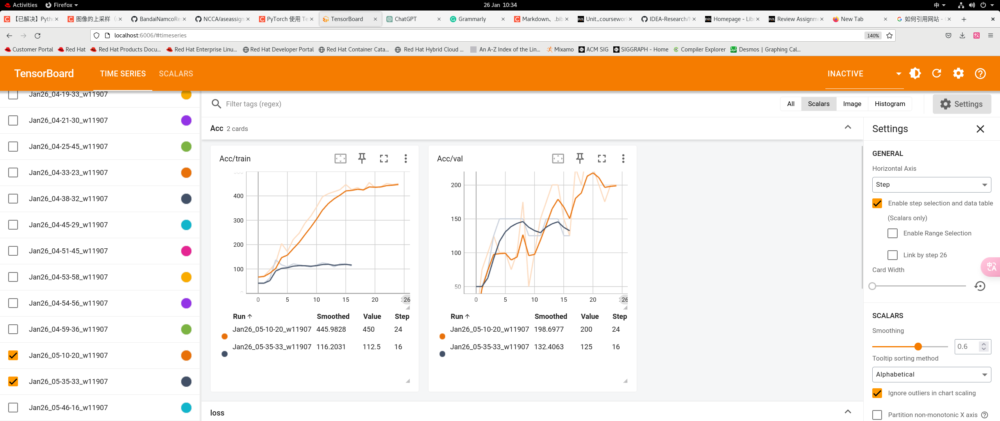

# Motion Classification Project

## Abstract
In this repository, I used Pytorch to implement a CNN network and a to classify video-based character motion classifier. After appropriate tuning, the model is capable of effectively distinguishing between different types of actions. Furthermore, I trained the dataset using the ResNet model provided in the class with the same set of parameters for comparison. This project utilized the BandaiMotion dataset, with the data being subjected to visualization and filtering. Based on this dataset, I designed a well-structured structure to store action data.

## 1. Introduction

In this project, implementing the training process includes: data preparation, data processing, model setup, training, testing, validation, unit testing, deployment, checkpointing, and logging.

The main program for training is located in ```./main.inbpy```.

The types of the dataset and motion data are defined in ```Model/BandaiDataset.py```

The two models are located respectively in files named ```Model/mymodel.py``` and ```Model/ResNet.py```.

The main training functions are written in ```Model/trainer.py```.

Finally, the unit tests are in ```./unittest.py```.


## 2 Data
### 2.1 Dataset description
 BandaiMotion dataset offers BVH data based on skeletons, which is a data structure relying on temporal offsets for joints. This significantly reduces both the space occupied by the data and the time required to download it.

A typical BVH data consists of two parts: the skeleton structure and the temporal offset records for joints.However, the BandaiMotion dataset provides a Python script based on Blender to facilitate the conversion of BVH to MP4 functionality.This enables us to visualize the changes in actions more intuitively. At the same time, it cleverly categorizes its action data into 17 classes, such as Walk and Run, making classification possible.

### 2.2 Data preprocessing
Firstly, utilize the Python script provided by Bandai to convert BVH data into MP4 video data using Blender.

[]

And then, check the labels and the corresponding labels for actions, filtering out data classes with fewer items.Before filtering, there were 177 motion data points with 17 content labels. After filtering, there are now 165 motion data points and 10 content labels.
[]

### 2.3 BandaiDataset Class

```BandaiDataset``` inherits from torch.utils.data.Dataset.The two necessary functions are: ```__getitem__``` and ```__len__``` These two functions respectively return the length of the dataset's dataframe and the data of a single dataframe. Therefore, the next step is to define a type for storing the dataframe.

### 2.4 Motion Class

```Motion``` class is defined for storing motiondata,In this class.

'input_motion' function uses OpenCV to input MP3 data. This data is stored as a list of pictures. This data is stored as a list of grayscale images named ```pose_list[]```. To show the image using plt, just simply use ```draw_pose()``` function in the class

In order to adapt to the model training, the function ```adjust(set_frame: int)``` works to process ```pose_list[]``` of different lengths into the same number of frames. For motion data with a frame count originally more or less than the specified frame count, adjust adopts two different approaches to handle the situation.For data with __fewer__ frames, ```adjust``` adopts the approach of __duplicating the entire sequence__ to extend the motion to the specified frame count.For data with __more__ frames, ```adjust``` __truncates the middle part__ of the motion data. This is because, it was found that, for the majority of data in this dataset, the middle part is the most representative. In this project, ```set_frame = 50```  .

```get_motion_tensor``` is the function to generate ```Torch.tensor``` from ```pose_list``` . Any data intended to enter the model should be of this type.

## 3. Models
This project employed two models: one is a custom-designed CNN model, and the other is the ResNet model provided in the course.Because for the ResNet model, my modifications were limited to adapting the input layer to suit the data in this project, so there is not much to elaborate on here. As for the CNN model,Its structure diagram is as follows:
[]

In the convolutional layers, we retain the frame count and only apply convolutional processing to the images.

## 4. Train
All crucial training functions are stored in ```Model/trainer.py``` . This includes ```train_model()```, the main program for training the model; ```save_checkpoint()```, a function to save the model during training to prevent data loss in case of unexpected interruptions; ```deployment()```, which allows redeployment of the model after training exits to resume training; ```EarlyStopper```,Early stopping is implemented to prevent overfitting during training;and so on. These functions are essentially consistent with the code provided in the course.

However, due to the different data types in this project compared to the course, ```custom_collate_fn()``` has been slightly modified to adapt to the dataset in this project. As the ```Motion``` class in ```Model/BandaiDataset.py``` provides the ```get_motion_tensor``` method, everything becomes much more straightforward.


## 5. Results & Discussion 
These are the training results displayed on TensorBoard.




## 6. Conclustion


This project is an assignment for software engineering; thus, the focus is primarily on implementing a complete AI training workflow by using a series of tools like PyTorch. In addition to achieving good training results, I have made efforts to ensure that my program possesses good scalability.


## Reference